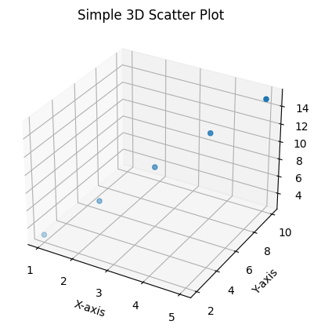

# 11 - Create a 3D Plot Graph using Matplotlib
 
1. **3D Plot Graph**

To convert the given code snippet into a 3D plot, we need to make some modifications. Here's an example of converting the code to a 3D scatter plot:

```python
import matplotlib.pyplot as plt
import numpy as np

# Sample data for the x, y, and z coordinates of the scatter plot
x = [1, 2, 3, 4, 5]
y = [2, 4, 6, 8, 10]
z = [3, 6, 9, 12, 15]

# Create a 3D scatter plot
fig = plt.figure()
ax = fig.add_subplot(111, projection='3d')
ax.scatter(x, y, z)

# Add labels and a title
ax.set_xlabel('X-axis')
ax.set_ylabel('Y-axis')
ax.set_zlabel('Z-axis')
plt.title('Simple 3D Scatter Plot')

# Show the plot
plt.show()
```

In this code, we import the necessary libraries, specify the x, y, and z coordinates of the scatter plot, create a 3D scatter plot using `fig.add_subplot(111, projection='3d')`, and add labels and a title to the plot. Finally, we display the plot using `plt.show()`.

