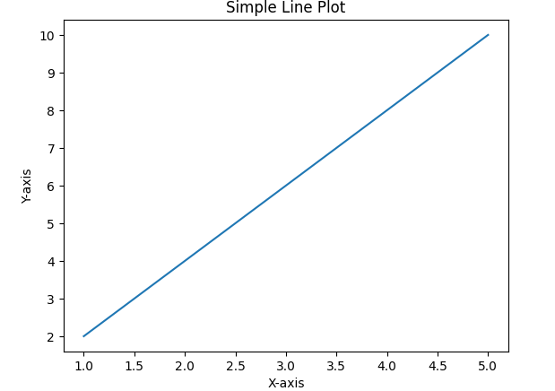

# 2 - Create a Line Graph using Matplotlib
 
1. **Line Graph**

```python
import matplotlib.pyplot as plt

# Sample data for the x and y coordinates of the line plot
x = [1, 2, 3, 4, 5]
y = [2, 4, 6, 8, 10]

# Create a line plot
plt.plot(x, y)

# Add labels and a title
plt.xlabel('X-axis')
plt.ylabel('Y-axis')
plt.title('Simple Line Plot')

# Show the plot
plt.show()
```

This code will create a simple line graph with the points `(1, 2), (2, 4), (3, 6), (4, 8),` and `(5, 10).` The `plt.plot()` function is used to create the line plot, and `plt.xlabel()`, `plt.ylabel()`, and `plt.title()` are used to add labels and a title to the plot.

When you run the script, it will display the line graph in a window. You can customize the plot further by adding legends, changing line styles, adding markers, adjusting colors, and much more. Matplotlib offers a wide range of options for creating various types of plots and customizing them to suit your needs.

