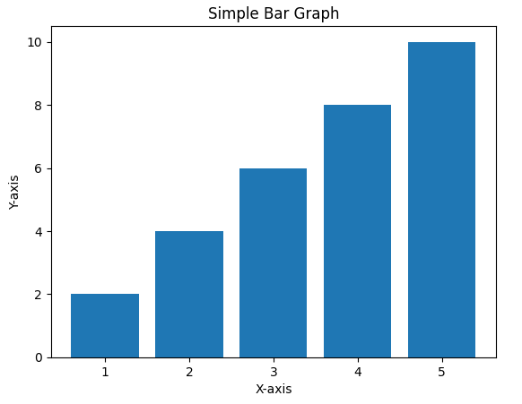

# 3 - Create a Bar Graph using Matplotlib
 
1. **Bar Graph**

To convert the given code to a bar graph, you can use the `plt.bar()` function instead of `plt.plot()`. Here's the modified code:

```python
import matplotlib.pyplot as plt

# Sample data for the x and y coordinates of the bar graph
x = [1, 2, 3, 4, 5]
y = [2, 4, 6, 8, 10]

# Create a bar graph
plt.bar(x, y)

# Add labels and a title
plt.xlabel('X-axis')
plt.ylabel('Y-axis')
plt.title('Simple Bar Graph')

# Show the plot
plt.show()
```

In this code, the `plt.bar()` function is used to create a bar graph. The `x` list represents the x-coordinates of the bars, and the `y` list represents the corresponding heights of the bars. The rest of the code remains the same, adding labels to the axes and a title to the graph. Finally, `plt.show()` displays the bar graph.

