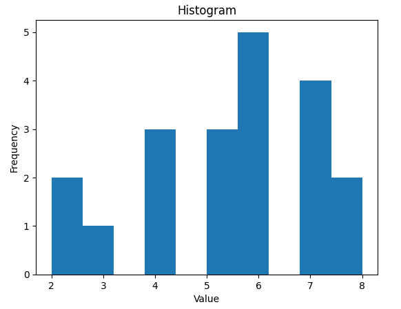

# 4 - Create a Histogram Graph using Matplotlib
 
1. **Histogram Graph**

To convert the given code to create a histogram graph instead of a line plot, you can use the `plt.hist()` function in Matplotlib. Here's the modified code:

```python
import matplotlib.pyplot as plt

# Sample data for the histogram
data = [2, 4, 2, 6, 8, 4, 5, 7, 3, 5, 6, 8, 7, 7, 7, 6, 6, 6, 5, 4]

# Create a histogram
plt.hist(data)

# Add labels and a title
plt.xlabel('Value')
plt.ylabel('Frequency')
plt.title('Histogram')

# Show the plot
plt.show()
```

In the modified code, we create a list `data` that contains the values for the histogram. Then, we use `plt.hist(data)` to create the histogram graph. The `plt.xlabel()`, `plt.ylabel()`, and `plt.title()` functions are used to add labels and a title to the plot. Finally, `plt.show()` displays the histogram graph.

