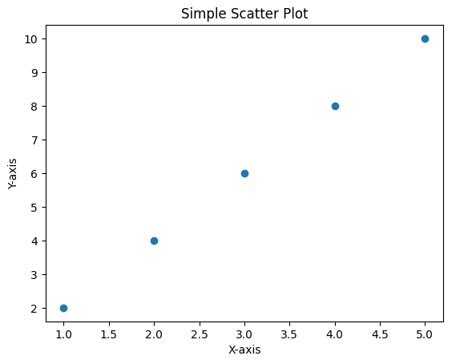

# 5 - Create a Scatter Plot Graph using Matplotlib
 
1. **Scatter Plot Graph**

To convert the given code to a scatter plot graph, you can replace the `plt.plot()` function with the `plt.scatter()` function. Here's the modified code:

```python
import matplotlib.pyplot as plt

# Sample data for the x and y coordinates of the scatter plot
x = [1, 2, 3, 4, 5]
y = [2, 4, 6, 8, 10]

# Create a scatter plot
plt.scatter(x, y)

# Add labels and a title
plt.xlabel('X-axis')
plt.ylabel('Y-axis')
plt.title('Simple Scatter Plot')

# Show the plot
plt.show()
```

In the modified code, the `plt.scatter()` function is used to create a scatter plot instead of the line plot. This function takes the x and y coordinates as input and plots individual data points as dots on the graph. The rest of the code remains the same, including the labels and title, and finally showing the plot using `plt.show()`.

