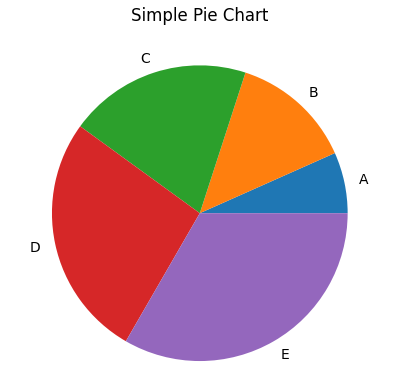

# 6 - Create a Pie Chart Graph using Matplotlib
 
1. **Pie Chart Graph**

To convert the given code into a pie chart graph, you need to modify the code as follows:

```python
import matplotlib.pyplot as plt

# Sample data for the categories and their corresponding values
categories = ['A', 'B', 'C', 'D', 'E']
values = [2, 4, 6, 8, 10]

# Create a pie chart
plt.pie(values, labels=categories)

# Add a title
plt.title('Simple Pie Chart')

# Show the plot
plt.show()
```

In the modified code, the `plt.plot()` function is replaced with `plt.pie()` to create a pie chart. The `values` list represents the numerical values for each category, and the `categories` list contains the labels for each category. These lists are used as input to the `plt.pie()` function.

Additionally, the `xlabel()` and `ylabel()` functions are removed since pie charts do not have axes. The title is still added using the `title()` function.

Running the modified code will produce a simple pie chart based on the given data.

