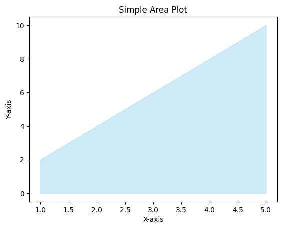

# 8 - Create a Area Plot Graph using Matplotlib
 
1. **Area Plot Graph**

To convert the code provided to create an area plot, you can use the `fill_between` function in Matplotlib. Here's the modified code:

```python
import matplotlib.pyplot as plt

# Sample data for the x and y coordinates
x = [1, 2, 3, 4, 5]
y = [2, 4, 6, 8, 10]

# Create an area plot
plt.fill_between(x, y, color='skyblue', alpha=0.4)

# Add labels and a title
plt.xlabel('X-axis')
plt.ylabel('Y-axis')
plt.title('Simple Area Plot')

# Show the plot
plt.show()
```

In the modified code, we use the `fill_between` function instead of `plot`. The `fill_between` function fills the area between the line plot and the x-axis, creating an area plot. We specify the `x` and `y` coordinates, and we can also customize the color and transparency of the area using the `color` and `alpha` parameters, respectively.

Now, when you run this code, it will generate an area plot instead of a line plot, where the area between the line and the x-axis will be filled with a light blue color.

