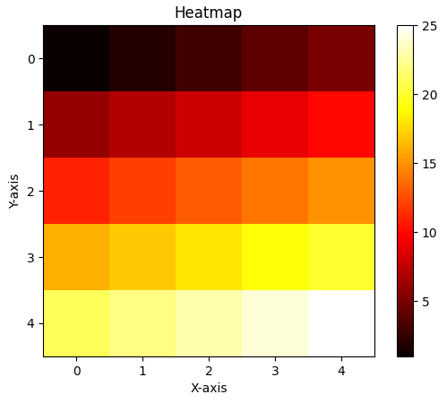

# 9 - Create a Heatmap Graph using Matplotlib
 
1. **Heatmap Graph**

To convert the given code into a heatmap graph, you need a 2D dataset. Heatmaps represent the intensity of values in a matrix by assigning colors to different levels of intensity. Here's an example of how you can modify the code to create a heatmap using the `imshow` function in Matplotlib:

```python
import numpy as np
import matplotlib.pyplot as plt

# Sample data for the heatmap
data = np.array([[1, 2, 3, 4, 5],
                 [6, 7, 8, 9, 10],
                 [11, 12, 13, 14, 15],
                 [16, 17, 18, 19, 20],
                 [21, 22, 23, 24, 25]])

# Create a heatmap
plt.imshow(data, cmap='hot')

# Add a colorbar for reference
plt.colorbar()

# Add labels and a title
plt.xlabel('X-axis')
plt.ylabel('Y-axis')
plt.title('Heatmap')

# Show the plot
plt.show()
```

In this example, `data` represents a 2D array of values that will be displayed as a heatmap. The `cmap` parameter sets the colormap to 'hot', which assigns colors ranging from dark to light to represent the intensity levels. The `colorbar()` function adds a colorbar on the side of the heatmap for reference.

You can replace the `data` array with your own 2D dataset to create a meaningful heatmap based on your data.

